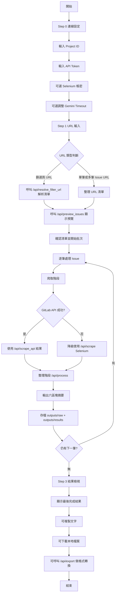
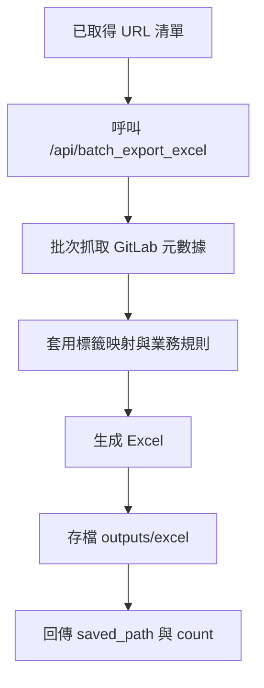
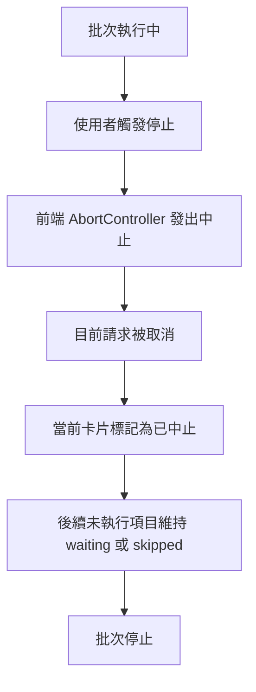

# GitLab Issue 整理工具 — 專案流程圖

> 依據 `docs/product/PRD.md`（最後更新：2026-04-10）整理。

## 1. 端到端流程（主要操作）

```mermaid
flowchart TD
    A[開始] --> B[Step 0 連線設定]
    B --> B1[輸入 Project ID]
    B1 --> B2[輸入 API Token]
    B2 --> B3[可選 Selenium 帳密]
    B3 --> B4[可選調整 Gemini Timeout]
    B4 --> C[Step 1 URL 輸入]

    C --> D{URL 類型判斷}
    D -->|篩選頁 URL| E[呼叫 /api/resolve_filter_url 解析清單]
    D -->|單筆或多筆 Issue URL| F[整理 URL 清單]
    E --> G[呼叫 /api/preview_issues 顯示預覽]
    F --> G
    G --> H[確認清單並開始批次]

    H --> I[逐筆處理 Issue]
    I --> J[爬取階段]
    J --> K{GitLab API 成功?}
    K -->|是| L[使用 /api/scrape_api 結果]
    K -->|否| M[降級使用 /api/scrape Selenium]
    L --> N[整理階段 /api/process]
    M --> N

    N --> O[輸出六區塊摘要]
    O --> P[存檔 outputs/raw + outputs/results]
    P --> Q{仍有下一筆?}
    Q -->|有| I
    Q -->|無| R[Step 3 結果檢視]

    R --> R1[顯示最後完成結果]
    R1 --> R2[可複製文字]
    R2 --> R3[可下載本地檔案]
    R3 --> R4[可呼叫 /api/export 做格式轉換]
    R4 --> S[結束]
```

## 2. Excel 直接匯出分支（不經 LLM）

```mermaid
flowchart TD
    A[已取得 URL 清單] --> B[呼叫 /api/batch_export_excel]
    B --> C[批次抓取 GitLab 元數據]
    C --> D[套用標籤映射與業務規則]
    D --> E[生成 Excel]
    E --> F[存檔 outputs/excel]
    F --> G[回傳 saved_path 與 count]
```

## 3. 中止流程（Abort）

```mermaid
flowchart TD
    A[批次執行中] --> B[使用者觸發停止]
    B --> C[前端 AbortController 發出中止]
    C --> D[目前請求被取消]
    D --> E[當前卡片標記為已中止]
    E --> F[後續未執行項目維持 waiting 或 skipped]
    F --> G[批次停止]
```
